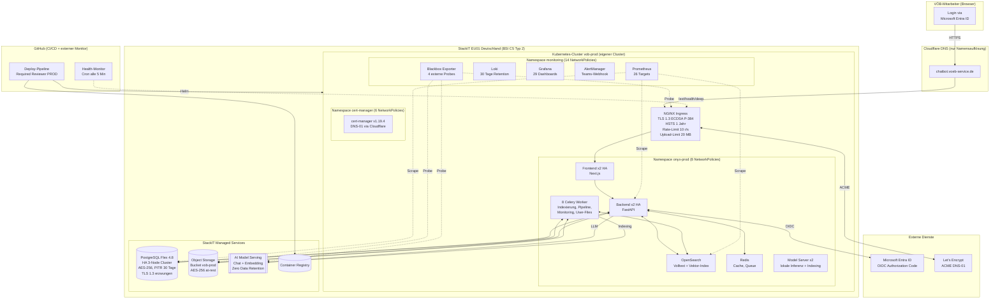
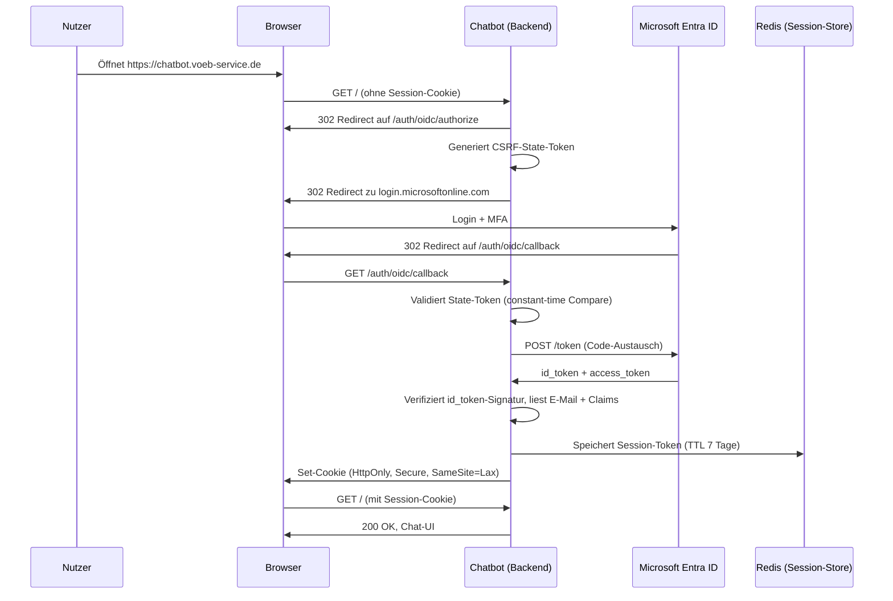
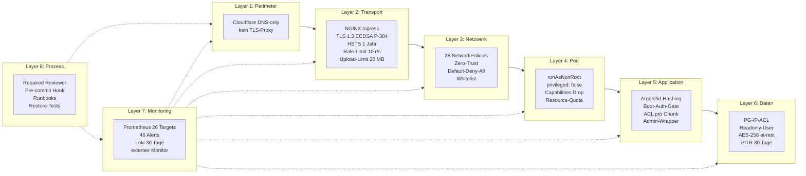
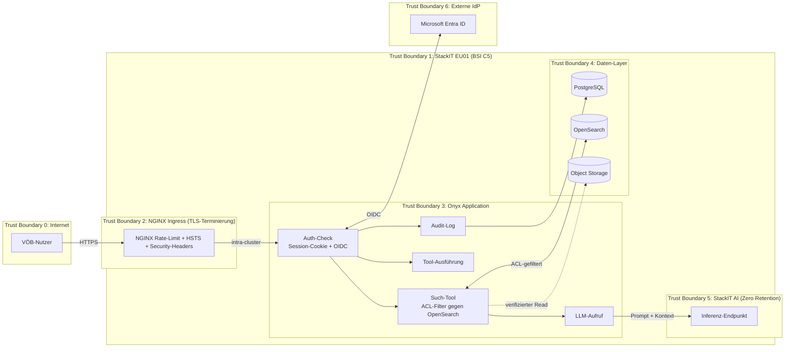

# VÖB Service Chatbot — Plattform-Übersicht

**Dokumentstatus**: Entwurf (Arbeitspapier)
**Version**: 0.3
**Stand**: 2026-04-21
**Autor**: Nikolaj Ivanov (CCJ Development)
**Zielgruppe**: IT-Leiter, Fachabteilung, Geschäftsleitung VÖB Service
**Zweck**: Technische Einordnung der Plattform hinter dem Chatbot — Stack, Dimensionierung, Sicherheits- und Betriebsansatz, Kostenrahmen

---

## Inhalt

1. Executive Summary
2. Systemarchitektur
3. Technologie-Stack im Überblick
4. Cloud-Infrastruktur (StackIT)
5. Kubernetes-Cluster und Applikations-Schicht
6. Datenbank
7. Objekt-Speicher
8. Such-Index (OpenSearch)
9. Verwendete KI-Modelle
10. Dimensionierung (aktuell + geplant)
11. Authentifizierung (Microsoft Entra ID, OIDC)
12. Sicherheitsarchitektur — Defense in Depth
13. Verantwortungsmatrix (Shared Responsibility)
14. Datenfluss und Trust Boundaries
15. Datenresidenz und Verschlüsselung
16. Onyx FOSS als Basis
17. CCJ Custom-Erweiterungen (9 Module)
18. Upstream-Sync-Fähigkeit (Prinzip "Extend, don't modify")
19. LLM- und RAG-spezifische Sicherheit
20. Monitoring, Logging und Alerting
21. Backup und Disaster Recovery
22. CI/CD-Pipeline
23. Philosophie und Begründung
24. Projektbeteiligte und Dienstleister
25. Laufende Kosten
26. Aufwand für ein Klon-Projekt

---

## 1. Executive Summary

Der VÖB Service Chatbot ist ein **RAG-basiertes KI-Assistenzsystem** (Retrieval-Augmented Generation) auf Basis der Open-Source-Plattform **Onyx** (MIT-Lizenz), betrieben auf der deutschen Cloud-Plattform **StackIT** und erweitert um **neun Custom-Module** von CCJ Development. Die Plattform folgt einem **Defense-in-Depth-Prinzip** mit acht aufeinander aufbauenden Schutzschichten und nutzt durchgängig BSI-C5-zertifizierte Infrastruktur.

Alle Nutzdaten (Chat-Konversationen, hochgeladene Dokumente, Audit-Logs) bleiben in der StackIT-Region EU01 (Deutschland); es findet kein Datentransfer in Drittländer statt. Die verwendeten Sprachmodelle (GPT-OSS 120B, Qwen3-VL 235B, Llama 3.3 70B) laufen ebenfalls auf StackIT-Infrastruktur unter vertraglich zugesicherter "Zero Data Retention" — Prompts und Antworten werden nicht gespeichert und nicht für Modelltraining verwendet. Die Authentifizierung erfolgt über **Microsoft Entra ID (OIDC)**, wodurch die bestehenden Identitäts- und MFA-Regeln der VÖB direkt greifen.

Die Custom-Module schließen Funktionen, die Onyx FOSS nicht abdeckt: einen persistenten **Audit-Trail** für Admin-Aktionen, **Token-Limits pro Nutzer** zur Kostenkontrolle und DoS-Abwehr, **gruppenbasierte Dokument-Zugriffskontrolle**, **deutsche Lokalisierung** der gesamten Oberfläche und ein vollständiges **Whitelabel**.

---

## 2. Systemarchitektur

Die Plattform gliedert sich in drei Schichten:

- **Infrastruktur-Schicht** — StackIT (Kubernetes, PostgreSQL, Objekt-Speicher, AI Model Serving), Region EU01 Deutschland
- **Applikations-Schicht** — Onyx FOSS (Backend, Frontend, Suche, Cache, Hintergrundjobs)
- **Erweiterungs-Schicht** — CCJ Custom-Module (Whitelabel, Token-Limits, Audit, Gruppenverwaltung, Dokument-Zugriff, Lokalisierung, Analysen, Prompts, Framework)

---

## 3. Technologie-Stack im Überblick

| Schicht | Komponente | Version | Zweck |
|---|---|---|---|
| Cloud-Provider | StackIT (Schwarz Digits) | — | Deutsche Cloud, Region EU01 |
| Container-Orchestrierung | StackIT SKE (Managed Kubernetes) | v1.33.9 | Runtime für alle Applikations-Pods |
| Betriebssystem (Worker Nodes) | Flatcar Linux | 4459.2.3 | Container-optimiert, Auto-Updates |
| Relationale Datenbank | PostgreSQL Flex (StackIT Managed) | 16 | Applikationsdaten, Chats, Audit-Log |
| Objekt-Speicher | StackIT Object Storage (S3-kompatibel) | — | Hochgeladene Dokumente |
| Such-Index | OpenSearch | 3.4.0 | Volltext- und Vektor-Suche (RAG) |
| Cache / Queue-Broker | Redis | 7.0.15 | Sessions, Celery-Queue |
| Backend-Framework | Python 3.11, FastAPI | 0.133.1 | REST-API |
| Hintergrundjobs | Celery | 5.5.1 | Indexierung, Dokument-Pipeline |
| Frontend | Next.js, React, TypeScript, Tailwind CSS | 16.1.7 / 19.2.4 / 5.9.3 / 3.4.17 | Web-Oberfläche |
| LLM-Abstraktion | LiteLLM | 1.81.6 | Einheitliche LLM- und Embedding-API |
| LLM-Inferenz | StackIT AI Model Serving | — | Chat + Embedding, Region EU01 |
| Authentifizierung | Microsoft Entra ID (OIDC) | — | Single Sign-On, MFA über Entra |
| Ingress / Reverse-Proxy | NGINX Ingress Controller | — | TLS-Terminierung, Security-Header, Rate-Limit |
| TLS-Zertifikate | cert-manager + Let's Encrypt | v1.19.4 | ECDSA P-384, TLSv1.3, Auto-Renewal |
| Monitoring | kube-prometheus-stack + Loki | 82.10.3 / 2.10.3 | Metriken, Logs, Alerts |
| Infrastructure as Code | Terraform (StackIT-Provider) | ~> 0.80 | Reproduzierbare Infrastruktur |
| CI/CD | GitHub Actions + Helm | — | Build → Registry → Deploy |

---

## 4. Cloud-Infrastruktur (StackIT)

**StackIT** ist die Cloud-Plattform der Schwarz-Gruppe (Schwarz Digits GmbH & Co. KG, Neckarsulm). Sie betreibt ausschließlich Rechenzentren in Deutschland und Österreich.

### 4.1 Genutzte StackIT-Dienste

Alle genannten Dienste sind im BSI-C5-Typ-2-Scope von StackIT enthalten (Details in 4.3).

| Dienst | Nutzung |
|---|---|
| SKE (Managed Kubernetes) | Cluster `vob-prod` (PROD), `vob-chatbot` (DEV/TEST) |
| PostgreSQL Flex (Managed Database) | Flex 4.8 HA (PROD), Flex 2.4 Single (DEV/TEST) |
| Object Storage (S3-kompatibel) | Buckets `vob-prod`, `vob-dev` |
| AI Model Serving | GPT-OSS, Qwen3-VL, Llama 3.3, Qwen3-VL-Embedding |
| Container Registry | Private Registry für Backend- und Frontend-Images |

### 4.2 Standorte und Regionen

| Region | Standort | Status | Nutzung |
|---|---|---|---|
| **EU01 Deutschland** | Neckarsulm-Region (DC01 Biberach, DC08 Ellhofen seit 2017) | operativ | Betrieb der gesamten Plattform |
| EU02 Österreich | DC10 Ostermiething | operativ | — |
| Neuer Campus | Lübbenau (Brandenburg) | im Bau, Fertigstellung Ende 2027 | — |

Die Plattform läuft vollständig in **Region EU01 (Deutschland)** — alle Kubernetes-Cluster, Datenbanken, Object-Storage-Buckets und LLM-Endpunkte.

### 4.3 Plattform-Zertifikate

StackIT verfügt über folgende Zertifizierungen und Attestierungen:

- **BSI C5 Typ 2** (Cloud Computing Compliance Control Catalogue) — gilt für SKE, PostgreSQL Flex, Object Storage, AI Model Serving, Container Registry
- **ISO 27001** (Informationssicherheits-Managementsystem)
- **ISO 27017** (Cloud-spezifische Sicherheitskontrollen)
- **ISO 27018** (Schutz personenbezogener Daten in der Cloud)
- **TÜVIT TSI** (Trusted Site Infrastructure) — bezieht sich auf die Rechenzentren

---

## 5. Kubernetes-Cluster und Applikations-Schicht

### 5.1 Cluster-Überblick (PROD)

| Parameter | Wert |
|---|---|
| Cluster-Name | `vob-prod` (eigener Cluster) |
| Kubernetes-Version | v1.33.9 |
| Node-Betriebssystem | Flatcar 4459.2.3 |
| Worker Nodes | 2x g1a.8d (8 vCPU, 32 GB RAM, 100 GB Disk) |
| Gesamtressourcen | 15.820 mCPU, 55 GiB RAM |
| Namespaces | onyx-prod, monitoring, cert-manager |
| IngressClass | nginx |
| Maintenance-Fenster | 03:00–05:00 UTC (StackIT-managed) |

### 5.2 Pods im Betrieb (PROD, 20 Pods)

| Komponente | Replicas | CPU-Limit | Speicher-Limit | Zweck |
|---|---|---|---|---|
| API-Server (FastAPI) | 2 (HA) | 1 vCPU | 4 GiB | REST-API für Frontend + Celery |
| Frontend (Next.js) | 2 (HA) | 0,5 vCPU | 1 GiB | Web-Oberfläche |
| NGINX Ingress | 1 | — | — | TLS-Terminierung, Rate-Limit |
| Redis | 1 | 0,5 vCPU | 1 GiB | Session-Cache, Celery-Broker |
| Celery Beat | 1 | 0,5 vCPU | 1 GiB | Scheduler für periodische Jobs |
| Celery Worker "Primary" | 2 (HA) | 1 vCPU | 2 GiB | Koordination Hintergrundjobs |
| Celery Worker "Light" | 1 | 1 vCPU | 2 GiB | OpenSearch-Ops, Permission-Sync |
| Celery Worker "Heavy" | 1 | 1 vCPU | 2 GiB | Dokument-Pruning |
| Celery Worker "Docfetching" | 1 | 1 vCPU | 2 GiB | Dokumente von Datenquellen abholen |
| Celery Worker "Docprocessing" | 1 | 1 vCPU | 2 GiB | Indexierung-Pipeline (Chunking + Embedding) |
| Celery Worker "Monitoring" | 1 | 0,5 vCPU | 0,5 GiB | System-Health, Queue-Längen |
| Celery Worker "User-File-Processing" | 1 | 1 vCPU | 2 GiB | Nutzer-Uploads |
| OpenSearch | 1 | 2 vCPU | 4 GiB + 30 GiB PV | Dokument-Index |
| Vespa (Zombie-Mode) | 1 | 0,5 vCPU | 4 GiB + 50 GiB PV | Legacy-Abhängigkeit (entfällt mit Onyx v4) |
| Model Server (Inference) | 1 | 2 vCPU | 4 GiB | Optionale lokale Inferenz |
| Model Server (Indexing) | 1 | 2 vCPU | 4 GiB | Alternative zu StackIT-Embedding |

### 5.3 Cluster-Varianten nach Umgebung

| Parameter | DEV | PROD |
|---|---|---|
| Cluster | `vob-chatbot` | `vob-prod` (eigener Cluster) |
| Namespace | onyx-dev | onyx-prod |
| Worker Nodes | 2x g1a.4d (4 vCPU, 16 GB) | 2x g1a.8d (8 vCPU, 32 GB) |
| PostgreSQL | Flex 2.4 Single | Flex 4.8 HA (3-Node) |
| API-Replicas | 1 | 2 (HA) |
| Frontend-Replicas | 1 | 2 (HA) |
| URL | dev.chatbot.voeb-service.de | chatbot.voeb-service.de |
| Authentifizierung | Entra ID (OIDC) | Entra ID (OIDC) |

---

## 6. Datenbank

| Parameter | DEV | PROD |
|---|---|---|
| Instanz-Name | vob-dev | vob-prod |
| Konfiguration | Flex 2.4 Single | Flex 4.8 HA (3-Node-Cluster) |
| Specs | 2 vCPU, 4 GB RAM, 20 GB SSD | 4 vCPU, 8 GB RAM, HA 3 Nodes |
| PostgreSQL-Version | 16 | 16 |
| Port | 5432 | 5432 |
| Verbindung | TLS 1.3 erzwungen (sslmode=require) | TLS 1.3 erzwungen |
| Verschlüsselung at-rest | AES-256 (StackIT-Default) | AES-256 |
| IP-Zugriffskontrolle (ACL) | auf Cluster-Egress + Admin-IP beschränkt | auf Cluster-Egress + Admin-IP beschränkt |
| Backup | täglich 02:00 UTC, 30 Tage Retention | täglich 01:00 UTC, 30 Tage + PITR sekundengenau |
| Lifecycle-Schutz | prevent_destroy = true (Terraform) | prevent_destroy = true |
| Applikations-User | `onyx_app` (login, createdb) | `onyx_app` |
| Read-Only-User | `db_readonly_user` (nur SELECT, für Analytics/Grafana) | `db_readonly_user` |

**Point-in-Time-Recovery (PROD):** Wiederherstellung auf jede Sekunde innerhalb der letzten 30 Tage möglich (WAL-basiert, StackIT Flex 4.8 HA).

**Backup-Monitoring:** Ein eigener CronJob `pg-backup-check` prüft alle vier Stunden, dass ein aktuelles Backup existiert, und alarmiert bei Ausfällen.

---

## 7. Objekt-Speicher

| Parameter | DEV | PROD |
|---|---|---|
| Bucket | vob-dev | vob-prod |
| Endpoint | object.storage.eu01.onstackit.cloud | object.storage.eu01.onstackit.cloud |
| Verschlüsselung at-rest | AES-256 | AES-256 |
| Transport | HTTPS | HTTPS |
| Versionierung | verfügbar, standardmäßig aus | verfügbar, standardmäßig aus |
| Object Lock | verfügbar (WORM) | verfügbar |

Der Bucket nimmt alle **von Nutzern hochgeladenen Dokumente** auf. Die eigentliche Indexierung (Volltext + Vektoren) erfolgt anschließend in OpenSearch.

---

## 8. Such-Index (OpenSearch)

| Parameter | DEV | PROD |
|---|---|---|
| Version | 3.4.0 | 3.4.0 |
| Modus | Single-Node | Single-Node |
| Ressourcen (CPU/RAM) | 300 mCPU / 1,5 GiB — 1 vCPU / 4 GiB | 1 vCPU / 2 GiB — 2 vCPU / 4 GiB |
| Persistentes Volumen | 30 GiB | 30 GiB |
| Authentifizierung | interner Admin-Benutzer (Passwort als K8s-Secret) | interner Admin-Benutzer, Passwort via GitHub Environment Secret |
| Rolle | Primärer Document-Index (Volltext + Vektor-Embeddings) | Primärer Document-Index |

OpenSearch dient als **RAG-Backend**: Die Chat-Frage wird vektorisiert und mit den ebenfalls vektorisierten Dokument-Chunks verglichen. Relevante Treffer werden als Kontext an das LLM übergeben.

**Hintergrund:** Onyx hat mit v3.0.0 von Vespa auf OpenSearch als Primär-Index migriert. Aus Kompatibilitätsgründen läuft Vespa minimal weiter ("Zombie-Mode"), bis Onyx v4 erscheint — er verarbeitet aber keine produktiven Daten mehr.

---

## 9. Verwendete KI-Modelle

Alle Modelle laufen auf **StackIT AI Model Serving** in der Region EU01 Deutschland. Es handelt sich um **gehostete Open-Source-Modelle**. Laut StackIT-Produktseite:

- "We do not store any customer data from the requests."
- "We do not train any models using your data."
- "Your data and queries are neither stored nor used to train models."

Die API ist stateless — die Gesprächshistorie muss vom Chatbot bei jeder Anfrage vollständig mitgesendet werden. Zwischen Requests findet keine Persistenz beim Modellanbieter statt.

### 9.1 Chat-Modelle (Produktion)

| Modell | Parameter | Kontext-Fenster | Rolle |
|---|---|---|---|
| **GPT-OSS 120B** | 120 Mrd. | 131.000 Tokens | Default-Modell für alle Chats |
| Qwen3-VL 235B | 235 Mrd. | 218.000 Tokens | Größtes Kontext-Fenster, multilingual |
| Llama 3.3 70B | 70 Mrd. | 128.000 Tokens | Alternative, besonders stabil bei Tool-Calling |

Nutzer können pro Chat zwischen den drei Modellen wählen.

### 9.2 Embedding-Modell

| Modell | Dimensionen | Kontext | Sprachabdeckung |
|---|---|---|---|
| **Qwen3-VL-Embedding 8B** | 4.096 | 32.768 Tokens | über 30 Sprachen inklusive Deutsch |

Das Embedding-Modell vektorisiert hochgeladene Dokumente und Nutzer-Fragen, damit semantische Suche über OpenSearch funktioniert.

### 9.3 API-Zugang

| Parameter | Wert |
|---|---|
| API-Base | https://api.openai-compat.model-serving.eu01.onstackit.cloud/v1 |
| Protokoll | OpenAI-kompatibel (Chat Completions + Embeddings) |
| Authentifizierung | Bearer Token (StackIT-seitig erstellt, als Kubernetes-Secret hinterlegt) |
| Region | EU01 Deutschland |

### 9.4 Rate-Limits (StackIT)

| Limit | Wert |
|---|---|
| Chat-Tokens pro Minute | 200.000 |
| Chat-Requests pro Minute | 80 (30 für GPT-OSS 120B) |
| Embedding-Tokens pro Minute | 200.000 |
| Embedding-Requests pro Minute | 600 |

---

## 10. Dimensionierung

### 10.1 Aktueller Stand (PROD)

| Parameter | Wert |
|---|---|
| Worker Nodes | 2 x g1a.8d |
| CPU je Node | 8 vCPU |
| RAM je Node | 32 GB |
| Disk je Node | 100 GB |
| Gesamt-CPU | 16 vCPU |
| Gesamt-RAM | 64 GB |
| Pods im Betrieb | 20 |
| CPU-Auslastung (30-Tage-Schnitt) | ca. 15–20 % |
| RAM-Auslastung (30-Tage-Schnitt) | ca. 25 % |
| Verfügbarkeit | 99,9 %+ (HA: 2x API, 2x Frontend, 3x PostgreSQL) |

**Sizing-Prognose:** Die aktuelle Konfiguration bedient ca. **150 gleichzeitige Nutzer** komfortabel.

### 10.2 Geplanter Downgrade (Kostenoptimierung)

Die 30-Tage-Messdaten zeigen eine deutliche Unterauslastung der Nodes. Daher ist ein Downgrade auf das gleiche Format wie DEV/TEST vorgesehen:

| Parameter | Aktuell | Geplant | Änderung |
|---|---|---|---|
| Node-Typ | g1a.8d | g1a.4d | –50 % |
| CPU je Node | 8 vCPU | 4 vCPU | –50 % |
| RAM je Node | 32 GB | 16 GB | –50 % |
| Gesamt-CPU | 16 vCPU | 8 vCPU | –50 % |
| Gesamt-RAM | 64 GB | 32 GB | –50 % |
| Erwartete CPU-Auslastung | 15–20 % | 30–40 % | |
| Erwartete RAM-Auslastung | 25 % | 50–60 % | |
| Einsparung | — | ~283 EUR netto/Monat | |

**Umsetzung:** Terraform-gestützt in einem Wartungsfenster am Wochenende. Rollback durch Terraform-Revert jederzeit möglich, Rollback-Zeit ca. 15 Minuten.

---

## 11. Authentifizierung (Microsoft Entra ID, OIDC)

Die Anmeldung erfolgt über **Microsoft Entra ID** (Single Sign-On, OIDC Authorization Code Flow). Das bedeutet:

- Alle VÖB-Mitarbeiter melden sich mit ihrem bestehenden VÖB-Microsoft-Konto an.
- **Multi-Faktor-Authentifizierung (MFA)** wird durch die Entra-ID-Richtlinien der VÖB erzwungen.
- Rollen (Administrator, Kurator, Basic) werden innerhalb des Chatbots gepflegt und durch Onyx-Admins zugewiesen.
- Automatische User-Anlage beim ersten Login (JIT-Provisioning): Der erste OIDC-Nutzer wird Administrator, alle weiteren erhalten die Rolle **Basic**.

### 11.1 Ablauf einer Anmeldung

### 11.2 Technische Schutzmaßnahmen

| Eigenschaft | Wert |
|---|---|
| Flow-Typ | Authorization Code Flow (sicherste Variante) |
| CSRF-Schutz | State-JWT + HttpOnly-Cookie, konstantzeitiger Vergleich |
| Session-Cookie | HttpOnly=true, Secure=true, SameSite=Lax |
| Session-Ablauf | 7 Tage (Verlängerung bei Aktivität) |
| Session-Speicherung | Redis (im Cluster, nicht auf externem Dienst) |
| Passwort-Hashing (interne Konten) | argon2id (OWASP-Empfehlung 2025) |

---

## 12. Sicherheitsarchitektur — Defense in Depth

Die Plattform setzt **acht aufeinander aufbauende Schutzschichten** ein. Jede Schicht muss unabhängig angegriffen werden; ein Versagen einer einzelnen Schicht führt nicht zum Systemkompromiss.

### Layer 1 — Perimeter (Cloudflare als reines DNS)

Cloudflare wird ausschließlich zur **Namensauflösung** eingesetzt (DNS-only), es gibt **keine TLS-Terminierung** bei Cloudflare. Der Datenverkehr fließt direkt zu StackIT. Vorteil: Es entsteht kein US-Cloud-Zwischenglied im Datenpfad.

### Layer 2 — Transport (NGINX Ingress)

- **TLS 1.3 only** mit Let's-Encrypt-Zertifikat, ECDSA P-384 (BSI-TR-02102-2-konform)
- **HSTS** mit 1 Jahr Gültigkeit plus `includeSubDomains`
- **Security Headers** vollständig gesetzt: X-Frame-Options DENY, X-Content-Type-Options nosniff, Referrer-Policy strict-origin-when-cross-origin, Permissions-Policy (alle Sensoren deaktiviert)
- **Rate-Limit** 10 Requests pro Sekunde je Client-IP auf `/api/*`-Pfaden
- **Upload-Limit** 20 MB pro Datei
- Echte Client-IP durch `externalTrafficPolicy: Local`

### Layer 3 — Netzwerk (Kubernetes NetworkPolicies)

**28 NetworkPolicies** in den drei kritischen Namespaces, nach Zero-Trust-Prinzip:

- `onyx-prod` (Applikation): 8 Policies
- `monitoring`: 14 Policies
- `cert-manager`: 6 Policies

Jeder Namespace startet mit einem `default-deny-all` — alle erlaubten Verbindungen sind explizit per Whitelist freigegeben.

### Layer 4 — Pod (Container-Härtung)

- **`runAsNonRoot: true`** in allen Applikations-Pods (User ID 1001 statt 0)
- **`privileged: false`** ohne Ausnahme
- **Capabilities Drop** (ALL) in den Exporter-Pods
- **`readOnlyRootFilesystem: true`** für Exporter-Pods
- Ausnahme: Vespa (Zombie-Mode, keine produktiven Daten) läuft aus Upstream-Gründen noch als Root. Entfällt mit Onyx v4.

### Layer 5 — Applikation

- **Onyx-Boot-Gate `check_router_auth`**: beim Start iteriert Onyx über alle Routen. Fehlt bei einer Admin-Route ein Auth-Dependency, startet der API-Server nicht. Schutz gegen versehentlich ungesicherte Admin-Endpoints.
- **ACL pro Chunk**: jeder Dokument-Chunk im OpenSearch-Index trägt eine explizite Zugriffsliste. Suchen filtern automatisch nach der Nutzer-ACL.
- **Input-Validierung** per Pydantic an allen API-Endpoints
- **SQLAlchemy ORM** ausschließlich — keine String-Konkatenation bei SQL, damit SQL-Injection strukturell ausgeschlossen
- **Session-Tokens**: kryptographisch sicher (`secrets.token_urlsafe`), in Redis gespeichert, HttpOnly-Cookie

### Layer 6 — Daten

- **PostgreSQL-IP-Zugriffsliste** auf zwei IPs beschränkt: Cluster-Egress-IP + Admin-IP. Kein offener DB-Zugriff aus dem Internet.
- **Read-only Benutzer** (`db_readonly_user`) für Grafana und Analytics — strikt SELECT-only, kann keine Daten ändern.
- **AES-256 Verschlüsselung at-rest** durch StackIT-Default
- **TLS 1.3 erzwungen** für jede Verbindung zur PostgreSQL
- **Point-in-Time-Recovery** über die letzten 30 Tage
- **Backup-Monitoring** alle 4 Stunden per CronJob

### Layer 7 — Monitoring

- **kube-prometheus-stack**: 26 Scrape-Targets, alle UP
- **46 Custom-Alert-Regeln** (zusätzlich zu den Prometheus-Standard-Alerts) inkl. PostgresDown, HighAuthFailureRate, High403Rate, OIDCCallbackErrors, CertExpiringSoon, HighTokenUsageSpike
- **Loki**: 30 Tage Log-Retention
- **Grafana**: 29 Dashboards (6 davon VÖB-spezifisch)
- **4 Blackbox-Probes** von außen: LLM-Endpoint, Entra ID, S3, Deep-Health
- **Externer Health-Monitor via GitHub Actions** (Cron alle 5 Minuten) — unabhängige Sicht außerhalb des Clusters
- Alarmierung via **Microsoft Teams** (eigener PROD-Kanal)

### Layer 8 — Prozess

- **Required Reviewer** für PROD-Deploys (GitHub Environment Gate)
- **Pre-commit-Hook** mit **17-Core-Datei-Whitelist** — verhindert versehentliche Onyx-Code-Änderungen
- **19 Runbooks** für wiederkehrende Operationen (Deploy, Secret-Rotation, Restore, Upstream-Sync u. a.)
- **Restore-Test** mit 100 % Datenintegrität zuletzt am 2026-03-15 (RTO 3:16 Minuten)
- **Alembic-Chain-Recovery** live getestet am 2026-04-17 nach Upstream-Sync

---

## 13. Verantwortungsmatrix (Shared Responsibility)

Die folgende Matrix zeigt die Aufgabenverteilung zwischen **StackIT** (Plattform), **Onyx FOSS** (Applikation) und **CCJ Development** (Erweiterungen und Härtung).

| Aspekt | StackIT | Onyx FOSS | CCJ Development |
|---|---|---|---|
| Rechenzentrums-Sicherheit | **Ja** (BSI C5 Typ 2, ISO 27001/17/18) | — | — |
| Hardware / Worker Nodes | **Ja** (Gardener SKE, Flatcar) | — | Node-Pool-Konfiguration, Wartungsfenster |
| Kubernetes Control Plane | **Ja** (Managed, Multi-Tenant-isoliert) | — | — |
| Worker-Node-Härtung | Default nicht geh. | — | **Ja** (runAsNonRoot, privileged:false) |
| Netzwerk-Isolation | VPC, LoadBalancer | — | **Ja** (28 NetworkPolicies, Zero-Trust) |
| TLS / HTTPS | L4-LoadBalancer (ohne TLS-Terminierung) | — | **Ja** (cert-manager, Let's Encrypt, ECDSA P-384) |
| Verschlüsselung at-rest | **Ja** (AES-256) | — | StackIT-Default übernommen |
| Verschlüsselung in-transit | **Ja** (TLS 1.3 für PG) | Cookie-Secure-Flag | erzwungen durch Ingress |
| Authentifizierung (Backend) | IAM für Platform-Admin | **Ja** (fastapi-users, argon2id) | Entra-ID-OIDC-Konfiguration |
| MFA für Endnutzer | — | — | **Ja** über Entra ID (Microsoft-seitig) |
| Autorisierung / Rollen | — | **Ja** (19 Permission-Tokens) | — |
| Gruppenbasierte Dokument-ACL | — | nur in Enterprise Edition | **Ja** (ext-access + ext-rbac) |
| Audit-Log für Admin-Aktionen | StackIT-Portal-Log | — | **Ja** (ext-audit, 15 Hooks) |
| LLM-Token-Tracking und -Limits | Rate-Limit pro Projekt | — | **Ja** (ext-token, Pre-Call-Enforcement) |
| Dokument-Zugriff auf Chunk-Ebene | — | **Ja** (ACL pro Chunk) | ergänzt um Gruppen-ACL |
| Session-Management | — | **Ja** (Redis, 7 Tage TTL) | — |
| CSRF-Schutz | — | **Ja** (OAuth-Flow, SameSite=Lax) | — |
| Input-Validierung | — | **Ja** (Pydantic) | **Ja** (Pydantic auch in allen ext-Routern) |
| Rate-Limiting | RPM/TPM beim AI Model Serving | `/auth/*` only, default aus | **Ja** (NGINX 10 r/s, Upload 20 MB) |
| PG-Sicherheit | **Ja** (TLS, Backup, HA) | — | **Ja** (ACL auf 2 IPs, Readonly-User, Backup-Check) |
| Object Storage | **Ja** (AES-256, IAM, Object Lock) | — | Lifecycle-Schutz via Terraform |
| AI Model Serving | **Ja** (Zero Data Retention, EU01) | — | Nutzung via Bearer-Token (rotierbar) |
| Container Registry | Trivy-Scanning vorhanden | — | private Registry, nur eigene Images |
| Supply Chain | — | — | **Ja** (SHA-gepinnte GitHub Actions, gepinnte Base-Images) |
| Monitoring und Alarmierung | — | `/metrics`-Endpoint | **Ja** (kube-prometheus-stack, Loki, 46 Alerts, externer Monitor) |
| Health-Check | — | `/api/health` (Liveness) | **Ja** (`/api/ext/health/deep`, DB+Redis+OpenSearch) |
| Backup und Disaster Recovery | **Ja** (PG 30 Tage, PITR) | — | Restore-Test, Alembic-Recovery-Runbook |
| Secret-Management | **Ja** (etcd AES-256) | — | **Ja** (GitHub Environment Secrets, Rotation-Runbook) |
| CI/CD-Härtung | — | — | **Ja** (Required Reviewer, Least-Privilege) |

---

## 14. Datenfluss und Trust Boundaries

Jede Grenze im folgenden Diagramm markiert einen Übergang in eine andere Vertrauenszone.

**Externe Verbindungen** beschränken sich auf drei klar umrissene Fälle:

1. **Microsoft Entra ID** — OIDC-Token-Austausch beim Login
2. **Let's Encrypt** — automatische Erneuerung der TLS-Zertifikate (DNS-01 via Cloudflare)
3. **Cloudflare DNS** — reine Namensauflösung, kein Proxy

Weder der Prompt noch der vom Chatbot gelesene RAG-Kontext werden an Dritte übertragen. Die LLM-Inferenz läuft auf StackIT-Infrastruktur in Deutschland.

---

## 15. Datenresidenz und Verschlüsselung

Alle Nutzdaten verbleiben **in der Region EU01 Deutschland**.

| Datentyp | Speicherort | Verschlüsselung | Replikation |
|---|---|---|---|
| Chat-Konversationen, Feedback, Nutzerprofile | PostgreSQL Flex (StackIT) | AES-256 at-rest, TLS 1.3 in-transit | HA 3-Node in EU01 |
| Hochgeladene Dokumente | Object Storage (`vob-prod`) | AES-256 at-rest, HTTPS | Multi-Location innerhalb EU01 |
| Chunks und Embeddings | OpenSearch (im Cluster) | AES-256 auf Persistent Volume | Single-Node (Replikation über PG-Backup) |
| **Prompts und LLM-Antworten** | **keine Speicherung beim Modellanbieter** | — | — |
| Audit-Logs | PostgreSQL `ext_audit_log` | AES-256 at-rest | HA 3-Node |
| Applikations-Logs | Loki (im Cluster, 30 Tage Retention) | auf Persistent Volume | Single-Node |
| Secrets (Credentials, API-Tokens) | Kubernetes Secrets (etcd) | AES-256 at-rest | 3-Node Control Plane |

---

## 16. Onyx FOSS als Basis

**Onyx** ist eine Open-Source-RAG-Plattform unter MIT-Lizenz (ursprünglich "Danswer"). Sie wird weltweit von über 100 Firmen eingesetzt und aktiv weiterentwickelt (im Schnitt mehrere Commits pro Tag).

### 16.1 Was Onyx mitbringt

- **RAG-Kern**: Chunking + Embedding + semantische Suche + LLM-Orchestrierung
- **100+ Connectoren** zu Datenquellen (Confluence, SharePoint, Slack u. v. m.)
- **Personas / Agents**: spezialisierte Assistenten mit eigenem Prompt und eigenen Datenquellen
- **Authentifizierung**: fastapi-users v15 mit vier Modi (basic, OAuth, OIDC, SAML)
- **Permission-System**: 19 Permission-Tokens mit Rollen-Modell (Admin, Curator, Basic)
- **Security-Baseline**: argon2id-Hashing, Boot-Auth-Gate, ACL pro Chunk, CSRF-Schutz
- **Telemetry-Off**-Schalter und **Disposable-E-Mail-Block**

### 16.2 Was Onyx FOSS nicht bietet

Funktionen, die Onyx nur in der kostenpflichtigen Enterprise Edition anbietet und die wir **vollständig selbst nachgebaut** haben:

- Persistentes Audit-Logging für Admin-Aktionen
- Token- und Kostenlimits pro Nutzer
- Gruppenbasierte Dokument-Zugriffskontrolle
- Whitelabeling über Logo hinaus
- Zentrale Verwaltung von System-Prompts
- Nutzungsanalysen und CSV-Export

Grund: Eine Onyx Enterprise Lizenz wird nicht eingesetzt. Alle entsprechenden Funktionen sind als eigenständige Module in `backend/ext/` und `web/src/ext/` umgesetzt.

---

## 17. CCJ Custom-Erweiterungen (9 Module)

Alle Module sind hinter **Feature-Flags** schaltbar. Ist ein Flag deaktiviert, läuft Onyx FOSS unverändert — Rollback ohne Deployment möglich.

| # | Modul | Feature-Flag | Funktion | Eigene DB-Tabellen |
|---|---|---|---|---|
| 1 | **ext-framework** | `EXT_ENABLED` | Basis: Router-Registrierung, Health-Endpoint, Feature-Flag-Zentrale, Admin-Wrapper | — |
| 2 | **ext-branding** | `EXT_BRANDING_ENABLED` | Whitelabel: VÖB-Logo, App-Name, Login-Text, Browser-Tab-Titel, Consent-Popup. Magic-Byte-Validierung für Logo-Uploads (PNG/JPEG), 2 MB Upload-Limit | `ext_branding_config` |
| 3 | **ext-token** | `EXT_TOKEN_LIMITS_ENABLED` | LLM-Nutzung tracken, Token-Limits pro Nutzer, Admin-Dashboard mit Live-Verbrauch, Prometheus-Counter (prompt/completion/requests je Modell). **Abwehr von LLM-DoS und Kostenangriffen.** | `ext_token_usage`, `ext_token_user_limit` |
| 4 | **ext-prompts** | `EXT_CUSTOM_PROMPTS_ENABLED` | Zentral pflegbare System-Prompts — Compliance-Guidance wird vor jedem Chat vor den User-Prompt gestellt | `ext_custom_prompts` |
| 5 | **ext-analytics** | `EXT_ANALYTICS_ENABLED` | Plattform-Nutzungsanalysen: eigenes Grafana-Dashboard mit 19 Panels, CSV-Export, Anomalie-Erkennung über Spikes | keine eigene Tabelle |
| 6 | **ext-rbac** | `EXT_RBAC_ENABLED` | Gruppenverwaltung (Admin-Seite `/admin/ext-groups`), Kurator-Rollen, Persona- und DocumentSet-Zuweisung auf Gruppen-Basis | nutzt Onyx-Tabellen |
| 7 | **ext-access** | `EXT_DOC_ACCESS_ENABLED` | Gruppen-basierte Dokument-Zugriffskontrolle: nur berechtigte Gruppen sehen bestimmte Dokumente. Filter wirkt bis in den Chunk-Level in OpenSearch. Fail-Closed bei Fehler (keine versehentliche Freigabe). | nutzt Onyx-Tabellen |
| 8 | **ext-i18n** | `NEXT_PUBLIC_EXT_I18N_ENABLED` | Deutsche Lokalisierung der gesamten Oberfläche (ca. 250 Core-Strings + 115 Admin-Strings) | keine (Frontend-only) |
| 9 | **ext-audit** | `EXT_AUDIT_ENABLED` | Persistenter Audit-Trail für Admin-Aktionen. 15 Hooks in 5 Routern, IP-Anonymisierung nach 90 Tagen, CSV-Export | `ext_audit_log` |

### 17.1 Audit-Log im Detail

Das `ext-audit`-Modul protokolliert folgende Aktionen:

| Bereich | Protokollierte Events |
|---|---|
| Branding | Änderungen, Logo-Upload, Logo-Löschung |
| Gruppenverwaltung | Anlegen / Ändern / Löschen von Gruppen, Mitglieder- und Kurator-Änderungen |
| Token-Limits | Anlegen / Ändern / Löschen von Nutzer-Budgets |
| System-Prompts | Anlegen / Ändern / Löschen |
| Dokument-Zugriff | Manueller Resync |

Je Event werden erfasst: UUID, Zeitstempel, auslösender Nutzer (E-Mail + Rolle), Aktion, Ressourcentyp/-id/-name, Details als JSON, IP-Adresse (nach 90 Tagen anonymisiert), User-Agent.

---

## 18. Upstream-Sync-Fähigkeit (Prinzip "Extend, don't modify")

Die Erweiterungen wurden nach einem strikten Prinzip umgesetzt: **Der Onyx-Code bleibt so weit wie möglich unverändert.** Nur **17 Dateien** im Onyx-Quellcode werden an minimalen Hook-Punkten angepasst (davon 16 aktuell aktiv gepatcht) — jede Änderung ist wenige Zeilen groß, hinter einem Feature-Flag versteckt und per `try/except` abgesichert.

| # | Datei (Auszug) | Zweck |
|---|---|---|
| 1 | `backend/onyx/main.py` | Registriert CCJ-Router |
| 2 | `backend/onyx/llm/multi_llm.py` | Hook für Token-Tracking |
| 3 | `backend/onyx/access/access.py` | Hook für Gruppen-ACL |
| 4 | `web/src/app/layout.tsx` | Aktiviert deutsche Lokalisierung |
| 5 | `web/src/components/header/` | Logo/Title im Header (aktuell noch offen) |
| 6 | `web/src/lib/constants.ts` | CSS-Variablen für Whitelabel |
| 7 | `backend/onyx/chat/prompt_utils.py` | Injiziert System-Prompts |
| 8 | `web/src/app/auth/login/LoginText.tsx` | Login-Text ersetzen |
| 9 | `web/src/components/auth/AuthFlowContainer.tsx` | Logo + App-Name |
| 10 | `web/src/sections/sidebar/AdminSidebar.tsx` | Admin-Links für ext-Module |
| 11 | `backend/onyx/db/persona.py` | Persona-Gruppen-Zuweisung |
| 12 | `backend/onyx/db/document_set.py` | DocumentSet-Gruppen-Zuweisung |
| 13 | `backend/onyx/natural_language_processing/search_nlp_models.py` | OpenSearch-Kompatibilität (Index-Name lowercase) |
| 14 | `web/src/refresh-components/popovers/ActionsPopover/index.tsx` | Actions-Popover für Basic-User ausblenden |
| 15 | `web/src/hooks/useSettings.ts` | Enterprise-Settings-Hook für Branding ohne EE-Lizenz |
| 16 | `web/src/providers/DynamicMetadata.tsx` | Browser-Tab-Titel nach Soft-Navigation nachziehen |
| 17 | `web/src/sections/sidebar/AccountPopover.tsx` | User-Menu Whitelabel (Onyx-spezifische Links ausgeblendet) |

**Konsequenz:** Sicherheitsupdates, Bugfixes und neue Features von Onyx können regelmäßig übernommen werden. Seit Projektstart wurden **fünf Upstream-Merges** durchgeführt (zwischen 71 und 415 Commits pro Merge), ohne dass die Extensions beschädigt wurden. Ein **Pre-commit-Hook** prüft die 17er-Whitelist automatisch bei jedem Git-Commit und verhindert unbeabsichtigte Änderungen außerhalb.

---

## 19. LLM- und RAG-spezifische Sicherheit

### 19.1 StackIT AI Model Serving — Zero Data Retention

Laut StackIT-Produktseite:

- "We do not store any customer data from the requests."
- "We do not train any models using your data."
- "Your data and queries are neither stored nor used to train models."

Die API ist stateless — die Gesprächshistorie muss vom Chatbot bei jeder Anfrage vollständig mitgesendet werden. **Zwischen Requests findet keine Persistenz beim Modellanbieter statt.**

### 19.2 Dokument-Zugriffskontrolle (RAG)

- **Zugriffsliste pro Chunk** im OpenSearch-Index (Onyx-Standardfunktion)
- **Gruppen-ACL** auf diese Chunk-Listen oben drauf (durch CCJ ergänzt)
- **Fail-Closed bei Fehler**: kann die ACL nicht korrekt aufgebaut werden, liefert das System eine **leere** Zugriffsliste — der Nutzer sieht also weniger, nicht mehr, als er dürfte. Falschanzeige sensibler Dokumente ist strukturell ausgeschlossen.
- **Re-Sync-Task**: bei Gruppen-Änderung wird die ACL in OpenSearch innerhalb von 60 Sekunden aktualisiert (Celery-Task im Hintergrund).

### 19.3 Tool-Inventar

Der Chatbot kann verschiedene Werkzeuge selbstständig aufrufen, um eine Frage zu beantworten. Aktuell auf PROD aktiv:

| Werkzeug | Status | Externe Schnittstelle? |
|---|---|---|
| Such-Werkzeug (interne RAG) | aktiv | nein |
| URL-Öffnen-Werkzeug | aktiv | ja (abgerufener Inhalt wird als Kontext genutzt) |
| Web-Suche | deaktiviert (kein Provider konfiguriert) | ja (erst beim Aktivieren) |
| Bildgenerierung | deaktiviert | — |
| Code-Interpreter | deaktiviert | — |
| Memory-Werkzeug | pro Nutzer konditional | nein |

Der Prompt selbst wird nie an externe Server übergeben; bei externen Werkzeugen werden nur die jeweils notwendigen Parameter (z. B. URL) übermittelt.

### 19.4 Output-Verhalten

Die eingesetzten Open-Source-Modelle (GPT-OSS, Qwen3-VL, Llama 3.3) bringen modellspezifische Safety-Layer mit. Zusätzliche Output-Moderation ist als Erweiterung vorgesehen (Roadmap).

---

## 20. Monitoring, Logging und Alerting

### 20.1 Monitoring-Stack

| Komponente | Zweck |
|---|---|
| Prometheus | Metriken-Sammlung (26 Scrape-Targets) |
| Grafana | Dashboards und Visualisierung (29 Dashboards) |
| AlertManager | Alert-Routing (zu Microsoft Teams) |
| Loki | Log-Aggregation (30 Tage Retention) |
| Promtail | Log-Shipping (DaemonSet auf allen Nodes) |
| Blackbox Exporter | externe HTTP-Probes (4 Stück) |
| Postgres Exporter | DB-Metriken (Connections, Locks, Replication) |
| Redis Exporter | Cache-Metriken |
| OpenSearch Exporter | Index-Metriken |
| cert-manager-Exporter | Zertifikat-Ablauf-Alerts |

### 20.2 Grafana-Dashboards (6 VÖB-spezifisch)

| Dashboard | Inhalt |
|---|---|
| PostgreSQL | Connections, Query-Performance, Locks |
| Redis | Memory, Latenz, Hit-Rate |
| SLA / SLO | Verfügbarkeit, Latenz, Error-Budget |
| Audit-Log | Admin-Aktionen (Loki-basiert) |
| Token-Usage | LLM-Verbrauch je Modell und Nutzer |
| Analytics Overview | Plattform-Nutzung (19 SQL-Panels über PG-Datasource) |

### 20.3 Alarmierung

- **46 Custom-Alert-Regeln** ergänzen die Prometheus-Standards
- **Alert-Fatigue-Mitigation**: Info-Alerts und "Watchdog" werden geroutet, Critical alle 4 h, Default alle 24 h
- Alarmkanal: eigener **Microsoft-Teams-Channel** für PROD
- **Externer Health-Monitor via GitHub Actions** (Cron alle 5 Minuten) prüft `/api/ext/health/deep` von außerhalb des Clusters — unabhängige Sicht

### 20.4 Alert-Beispiele

- `PostgresDown` — DB-Ausfall (nicht nur Exporter-Pod)
- `HighAuthFailureRate` — über 50 % Auth-4xx über 5 Minuten
- `High403Rate` — ungewöhnlich viele 403-Antworten
- `OIDCCallbackErrors` — gehäufte OIDC-Fehler
- `CertExpiringSoon` — Zertifikat läuft in < 14 Tagen ab
- `HighTokenUsageSpike` — ungewöhnlicher LLM-Verbrauch
- `BackupMissing` — PostgreSQL-Backup fehlt seit > 30 Stunden

---

## 21. Backup und Disaster Recovery

### 21.1 PostgreSQL

| Parameter | Wert |
|---|---|
| Backup-Zeitpunkt | täglich 01:00 UTC |
| Retention | 30 Tage |
| Point-in-Time-Recovery | sekundengenau über die letzten 30 Tage (PROD, Flex 4.8 HA) |
| Backup-Monitoring | CronJob `pg-backup-check` alle 4 h; Alert `BackupMissing` |

### 21.2 Object Storage

- Objekte werden Multi-Location innerhalb EU01 repliziert (StackIT-Default)
- Object Lock (WORM) für revisionssichere Ablage verfügbar
- Lifecycle-Schutz per Terraform (`prevent_destroy = true`)

### 21.3 Applikation

- **Helm-Release-Rollback** in unter 5 Minuten möglich
- **Alembic-Chain-Recovery** für Datenbank-Migrationen (live getestet am 2026-04-17)
- Container-Images sind SHA-identifiziert und in der StackIT-Registry vorhanden

### 21.4 Getestete Recovery-Zeit

- **RTO gemessen (DEV, 17 MB DB):** technisch 3:16 Minuten, operativ 7:15 Minuten
- **Letzter Restore-Test:** 2026-03-15 mit 100 % Datenintegrität
- **Nächster Restore-Test:** 2026-06-15 (quartalsweise geplant)

---

## 22. CI/CD-Pipeline

| Parameter | Wert |
|---|---|
| Pipeline-Tool | GitHub Actions |
| Build | parallel (Backend + Frontend), ca. 8 Minuten |
| Actions | **SHA-gepinnt** (Supply-Chain-Sicherheit) |
| Base-Images | versioniert gepinnt |
| Permissions | `contents: read` (Least Privilege) |
| Concurrency | 1 Deploy pro Umgebung gleichzeitig |
| DEV-Deploy | automatisch bei Push auf `main` |
| PROD-Deploy | **manuell + Required Reviewer** (GitHub Environment-Gate) |
| Smoke-Test PROD | 18 Versuche à 10 Sekunden (ca. 3 Minuten) |
| Helm-Flags | `--wait --timeout 15m --history-max 5` |
| Container-Registry | StackIT Container Registry (private) |
| Branch-Protection | PR erforderlich, 3 Status-Checks (helm-validate, build-backend, build-frontend) |

Der Upstream-Sync mit Onyx läuft über einen separaten Branch mit Pull-Request-Review (Diff-Inspektion vor Merge). Ein wöchentlicher CI-Check prüft automatisch, ob Upstream-Commits zu Merge-Konflikten mit unseren Extensions führen.

---

## 23. Philosophie und Begründung

### 23.1 Warum StackIT?

- **Datensouveränität**: 100 % deutscher Betreiber (Schwarz-Gruppe), Rechenzentren ausschließlich in Deutschland und Österreich
- **BSI C5 Typ 2** und ISO 27001 / 27017 / 27018 vorhanden
- **Managed Services**: Kubernetes, PostgreSQL, Objekt-Speicher, AI Model Serving — geringer Betriebsaufwand
- **AI Model Serving in Deutschland**: offene große Sprachmodelle (GPT-OSS 120B, Qwen3-VL 235B, Llama 3.3 70B) mit Zero Data Retention — in keiner anderen deutschen Cloud heute vergleichbar einfach nutzbar
- **Deutscher Support**: Sprache, Zeitzone, Kultur — schnellere Incident-Response

**Abgelehnte Alternativen:**

| Alternative | Grund der Ablehnung |
|---|---|
| AWS Frankfurt | US-Unternehmen, CLOUD Act |
| Microsoft Azure | US-Unternehmen, gleiche Bedenken wie AWS |
| Google Cloud | US-Unternehmen, gleiche Bedenken |
| Hetzner | kein Managed Kubernetes, kein Managed Storage in ausreichender Form |
| On-Premise / Private Cloud | zu lange Time-to-Market, hoher laufender Betriebsaufwand, fehlende K8s-Expertise beim Kunden |

### 23.2 Warum Onyx FOSS als Basis?

- **Time-to-Market**: eine funktionsfähige RAG-Plattform in vier Wochen statt in zwölf Monaten Eigenentwicklung
- **Lizenz**: MIT — uneingeschränkte kommerzielle Nutzung, Modifikation, Weiterverteilung
- **Aktive Community**: wöchentliche Releases, regelmäßige Security-Patches, aktive Feature-Entwicklung
- **Upstream-Sync-Fähigkeit**: durch das "Extend, don't modify"-Prinzip können Security-Updates und neue Features regelmäßig übernommen werden

### 23.3 Warum Feature-Flags für jede Erweiterung?

- **Selektive Aktivierung** pro Umgebung (DEV / TEST / PROD)
- **Rollback-Fähigkeit** ohne Deployment (nur Flag umstellen)
- **Clean Baseline**: Wenn alle Flags aus sind, läuft die Plattform wie Onyx FOSS — ohne Code-Rückstände

### 23.4 Warum Entra ID statt eigene Nutzerverwaltung?

- **Kein zweiter Identity-Store**: VÖB pflegt Identitäten nur einmal in Entra
- **MFA "gratis"**: die bereits bei VÖB etablierten MFA-Regeln greifen automatisch
- **Zertifizierungen**: Entra ID ist Teil des Azure-Compliance-Scopes mit ISO 27001 und SOC 2 Type 2
- **Onboarding / Offboarding**: wer aus VÖB ausscheidet, verliert automatisch Zugang zum Chatbot

---

## 24. Projektbeteiligte und Dienstleister

### 24.1 Projektbeteiligte

| Rolle | Organisation / Person |
|---|---|
| Auftraggeber | **VÖB Service** — Pascal Witthoff (Product Owner), Leif Rasch (IT-Infrastruktur) |
| Auftragnehmer, Tech Lead, Entwicklung | **CCJ Development** — Nikolaj Ivanov, Benito De Michele |

### 24.2 Eingesetzte Dienstleister

| Kategorie | Anbieter |
|---|---|
| Cloud-Infrastruktur | **StackIT** (Schwarz Digits GmbH & Co. KG, Neckarsulm) |
| Domain-Registrar / autoritatives DNS | **GlobVill** (hostet die Zone `voeb-service.de`) |
| DNS-Layer für den Chatbot | **Cloudflare** (DNS-only, kein Proxy; ermöglicht automatische TLS-Erneuerung via cert-manager) |
| Identity-Provider (Single Sign-On) | **Microsoft Entra ID** (OIDC) |
| TLS-Zertifizierungsstelle | **Let's Encrypt** / ISRG |

---

## 25. Laufende Kosten (netto, monatlich)

Aktueller Stand (vor dem geplanten Downgrade der PROD-Nodes):

| Posten | Leistungsumfang | DEV | PROD |
|---|---|---|---|
| Kubernetes-Management-Fee | 1× Managed Control Plane je Cluster (Auto-Patching, Maintenance-Fenster, HA-Masters) | 71,71 EUR | 71,71 EUR |
| Worker Nodes | **DEV:** 2× g1a.4d (je 4 vCPU, 16 GB RAM, 100 GB Disk) — **PROD:** 2× g1a.8d (je 8 vCPU, 32 GB RAM, 100 GB Disk) | 283,18 EUR | 566,36 EUR |
| PostgreSQL Flex | **DEV:** Flex 2.4 Single (2 vCPU, 4 GB RAM, 20 GB SSD) — **PROD:** Flex 4.8 HA 3-Node-Cluster (je 4 vCPU, 8 GB RAM). Beide inkl. täglicher Backups + 30-Tage-Retention; PROD zusätzlich PITR sekundengenau | 105,54 EUR | 316,23 EUR |
| Object Storage | verbrauchsabhängig (ca. 0,027 EUR/GB/Monat); aktueller Stand entspricht ca. 10 GB je Bucket | 0,27 EUR | 0,27 EUR |
| Load Balancer | Essential-10 Tier (Basis-Stufe der StackIT Network Load Balancer, 1 öffentliche IPv4) | 9,39 EUR | 9,39 EUR |
| **Summe** | | **470,09 EUR** | **963,96 EUR** |

**Gesamt beide Umgebungen: 1.434,05 EUR netto/Monat**

### 25.1 Anmerkungen zur Kostenlogik

- **Fixkosten (Compute + Infrastruktur):** K8s-Management, Worker Nodes, PostgreSQL Flex und Load Balancer werden unabhängig vom Nutzungsgrad in voller Höhe abgerechnet. Sie machen aktuell **über 99 %** der Kosten aus.
- **Verbrauchsabhängig:** Object Storage wird pro GB und Stunde abgerechnet. Die Cent-Beträge in der Tabelle reflektieren den tatsächlichen aktuellen Speicherverbrauch, nicht eine Grundgebühr.
- **Nicht enthalten:**
  - StackIT Container Registry (minimal, nutzungsabhängig)
  - StackIT AI Model Serving — abhängig vom Chat-Volumen; aktuell überschaubar (StackIT rechnet hier per Token ab, nicht per Grundgebühr)

**Nach dem geplanten Downgrade** der PROD-Nodes auf g1a.4d reduziert sich die PROD-Summe um ca. **283 EUR** auf rund **681 EUR / Monat** (Gesamt: ~1.151 EUR).

Alle Preise netto, zuzüglich MwSt. Preisstand März 2026.

---

## 26. Aufwand für ein Klon-Projekt

*In Absprache mit Benito.*
